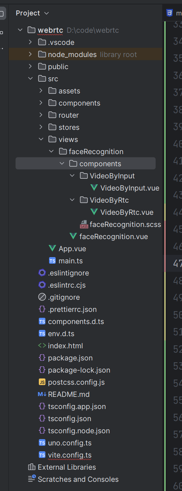
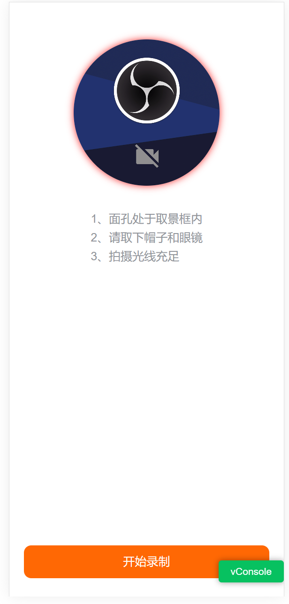
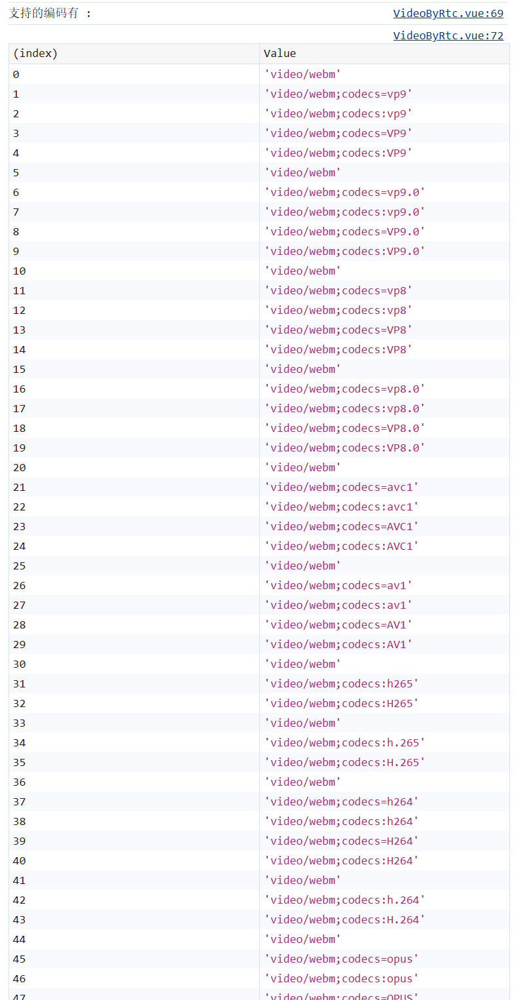

### 什么是 WebRTC ？

MDN对WebRTC的介绍如下：

>WebRTC（Web Real-Time Communications）是一项实时通讯技术，它允许网络应用或者站点，在不借助中间媒介的情况下，建立浏览器之间点对点（Peer-to-Peer）的连接，实现视频流和（或）音频流或者其他任意数据的传输。WebRTC 包含的这些标准使用户在无需安装任何插件或者第三方的软件的情况下，创建点对点（Peer-to-Peer）的数据分享和电话会议成为可能。

简单来说，WebRTC 是一个可以在 Web 应用程序中实现音视频和数据的实时通信的开源项目。在WebRTC中，音视频数据的采集和编解码等一系列复杂处理都交由浏览器的底层封装来完成。我们可以直接拿到优化后的媒体流，然后将其输出到本地屏幕和扬声器，或者转发给其对等端。
<!--more-->

### 实现人脸录制所需的核心方法
- getUserMedia

WebRTC提供了`navigator.mediaDevices.getUserMedia`API来获取当前设备的摄像头和麦克风，实现在手机上进行人脸录制功能，我们只需调用时指定优先前置或后置摄像头即可，手机端浏览器已经封装了`facingMode`参数，不用提前获取设备集合。一些复杂场景下还可以选择多个摄像头进行录制，不过本次分享先按下不表。

- MediaRecorder

使用 `MediaRecorder` 对 `getUserMedia`返回的媒体流`MediaStream`进行录制，是实现人脸录制功能的核心对象

需要注意的是，`getUserMedia`需要在符合安全源的情况下才能使用，如https协议、本地localhost、wss协议，直接使用http+ip的形式访问的话，无法取到`getUserMedia`方法。


### 基本的实现流程
实现人脸录制用得最多的场景便是业务中进行人脸识别，与服务器数据进行活体比对，大致的实现流程如下：
- 进人脸录制页面
- 唤起摄像头（授权）
- 对媒体流进行处理（录制视频）
- 处理录制好的视频
- 上传服务器，服务器返回比对结果

但是真正要上线的代码还需要处理更多边界情况

### 兼容性检测
可能有人会认为`WebRTC`在手机端浏览器兼容性会比PC好，但事实恰恰相反，在我实际的测试过程中，手机端浏览器对`WebRTC`的支持一言难尽，普遍有支持不全的情况，仅仅是唤起摄像头这一步，手机端不同的浏览器可能会报不一样的错误。 
所以在实现视频录制之前，我们需要先进行兼容性检测，并且准备好降级方案，采用`input`上传。

#### detectrtc
`detectrtc` 是一个用于检测`WebRTC`功能的库，我们可以用它来检测当前设备、浏览器对WebRTC的支持度

```javascript
import {
  isWebRTCSupported,
  isGetUserMediaSupported,
  hasWebcam,
  load
} from 'detectrtc'
export default {
  //...
  created(){
    // 对当前设备以及使用的浏览器进行兼容性检测
    load(() => {
      console.info('isWebRTCSupported', isWebRTCSupported)
      console.info('isGetUserMediaSupported', isGetUserMediaSupported)
      console.info('hasWebcam', hasWebcam)
      if (!isGetUserMediaSupported) {
        // 切换到input方案
      }
    })
  }
//...
}

```
手机端可以通过打开 [https://www.webrtc-experiment.com/DetectRTC/](https://www.webrtc-experiment.com/DetectRTC/)来检测当前浏览器对`WebRTC`相关API的支持情况

#### webrtc-adapter.
`webrtc-adapter`是一个抹平不同浏览器对`WebRTC`API的实现和执行行为差异的工具，导入这个库后，我们不用区分不同浏览器对`WebRTC`API的实现差异。

#### 理想很丰满，现实很骨感
本以为通过`detectrtc`做好兼容性检测后，便能轻松实现实时视频录制，但是架不住各个手机浏览器的奇怪报错，部分浏览器在使用相关通过`detectrtc`检测通过后的API时，还是不能正常唤起摄像头，或者时唤起摄像头后无法进行录制。此时只能进行降级，切换到input方案。

### 具体实现

#### 准备项目及页面
新建立一个基本的vue3项目，目录结构如下


通过上面的分析，实现录制人脸功能时，我们需要准备两套方案
- 通过WebRTC录制（可自由定制录制页面样式，对录制的视频实时处理，兼容性略差）
- 通过input拍摄后上传（只能使用原生相机界面，无法定制，是目前最基本的且成熟的拍视频上传模式）

在录制页面准备两个组件
`VideoByInput`
`VideoByRtc`

VideoByRtc：


VideoByInput：


#### 检测是否支持WebRTC录制
`faceRecognition.vue`

录制页面加载时，我们需要检测WebRTC的支持情况，来判断进入那种模式。
```vue
<script setup lang="ts">
import VideoByRtc from '@/views/faceRecognition/components/VideoByRtc/VideoByRtc.vue'
import VideoByInput from '@/views/faceRecognition/components/VideoByInput/VideoByInput.vue'
import { ref } from 'vue'

const VERIFY_TYPE = {
  videoByInput: 'refVideoByInput',
  videoByRtc: 'refVideoByRtc'
}
const verifyType = ref(VERIFY_TYPE.videoByRtc)
import {
  isWebRTCSupported,
  isGetUserMediaSupported,
  hasWebcam,
  load
} from 'detectrtc'

load(() => {
  console.info('isWebRTCSupported', isWebRTCSupported)
  console.info('isGetUserMediaSupported', isGetUserMediaSupported)
  console.info('hasWebcam', hasWebcam)
  if (!isGetUserMediaSupported) {
    // 不支持WebRTC，切换为input方案
    verifyType.value = VERIFY_TYPE.videoByInput
  }
})
</script>

```
```vue
<template>
  <div style="height: 100%" class="FaceRecognition">
    <VideoByRtc
        v-if="verifyType === VERIFY_TYPE.videoByRtc"
        ref="refVideoByRtc"
        @notSupported="notSupported"
        @finished="finished"
    />
    <VideoByInput
        v-if="verifyType === VERIFY_TYPE.videoByInput"
        @finished="finished"
        ref="refVideoByInput"
    />
  </div>
</template>
```
#### 使用WebRTC方案
`VideoByRtc.vue`

- 检测当前设备、浏览器支持录制的视频格式和编码

一些浏览器在使用`MediaRecorder`的时候如果指定的`mimeType`不支持，会出现录制报错、保存后的视频黑屏等奇葩情况，检测常用的视频编码，确保兼容性。

```javascript
/**
 * 获取当前设备支持的视频编码和格式
 */
const getSupportedMimeTypes = () => {
  const VIDEO_TYPES = ['webm', 'ogg', 'mp4', 'x-matroska']
  const VIDEO_CODECS = [
    'vp9',
    'vp9.0',
    'vp8',
    'vp8.0',
    'avc1',
    'av1',
    'h265',
    'h.265',
    'h264',
    'h.264',
    'opus'
  ]

  const supportedTypes = []
  VIDEO_TYPES.forEach(videoType => {
    const type = `video/${videoType}`
    VIDEO_CODECS.forEach(codec => {
      const variations = [
        `${type}`,
        `${type};codecs=${codec}`,
        `${type};codecs:${codec}`,
        `${type};codecs=${codec.toUpperCase()}`,
        `${type};codecs:${codec.toUpperCase()}`
      ]
      variations.forEach(variation => {
        // 通过MediaRecorder提供的isTypeSupported检查支持的格式和编码
        if (window.MediaRecorder.isTypeSupported(variation))
          supportedTypes.push(variation)
      })
    })
  })
  return supportedTypes
}
```
通过组合且通过检测得到的MimeTypes样例如下，不同浏览器及设备可能会有差异。



- 开启摄像头并生成MediaRecorder

```javascript
/**
 * @description 打开摄像头后获得媒体流，初始化MediaRecorder
 */
const openUserMedia = () => {
    const supportedMimeTypes = getSupportedMimeTypes()
    console.log(
      '支持的编码有 : '
    )
    console.table(supportedMimeTypes)
    const video = unref(refVideo)
    window.navigator.mediaDevices
      .getUserMedia({
        video: {
          aspectRatio: { ideal: 1 },
          facingMode: 'user' // 优先调前置摄像头
        },
        audio: false // 不需要音频
      })
      .then(stream => {
        // 拿到媒体流
        mediaStream.value = stream
        let winURL = window.URL || window.webkitURL
        if ('srcObject' in unref(refVideo)) {
          video.srcObject = stream
        } else {
          video.src = winURL.createObjectURL(stream)
        }
        video.muted = true
        // 设置视频加载完成的监听方法
        video.onloadedmetadata = () => {
          if (video) {
            video.play()
            nextTick(onPlay)
          }
        }
        // 生成录制对象，指定mimeType
        mediaRecorder.value = new MediaRecorder(stream, {
          mimeType: supportedMimeTypes[0],
          videoBitsPerSecond: 2500000 // 视频码率
        })
      })
      .catch(() => {
        video?.pause()
        closeStream()
        // 初始化过程中出错，降级
        emit('notSupported')
      })
  }
```

- 配合`face-api.js`等人脸检测库，实时提示用户调整脸部位置，将人脸对准到取景框中。

只要录制未结束前，每100ms检测一次人脸是否离开了取景框。
```javascript
import {
  loadTinyFaceDetectorModel,
  detectSingleFace,
  TinyFaceDetectorOptions
} from 'face-api.js'


const onPlay = async () => {
  const video = unref(refVideo)
  if (unref(recordStatus) === unref(RECORD_STATUS).end || !video) {
    return
  }
  // 视频处于暂停或结束状态下，不去执行检测逻辑
  if (video.paused || video.ended) {
    return setTimeout(() => onPlay(), 100)
  }
  // 持续进行人脸检测扫描，人脸不在镜头就提示用户
  const faceDetectionTask = await detectSingleFace(
    video,
    new TinyFaceDetectorOptions({
      inputSize: 512,
      scoreThreshold: 0.1
    })
  )
  console.log('!!faceDetectionTask', !!faceDetectionTask)
  hasFace.value = !!faceDetectionTask
  setTimeout(() => onPlay(), 100)
}

```
```javascript
onMounted(async () => {
  openUserMedia()
  // 需要读取face-api.js需要的训练模型
  await loadTinyFaceDetectorModel(
    '/models'
  )
})
```

人脸离屏检测的效果如下


#### 开始录制

```javascript
/**
 * 开始录制
 */
const startRecorder = () => {
    if (unref(recordStatus) !== unref(RECORD_STATUS).default) {
      return
    }
    // 每次数据准备好后将切片数据保存，录制结束后合并
    unref(mediaRecorder).ondataavailable = ({ data }) => {
      recordedBlob.value.push(data)
    }
    // 指定时间切片，1s生成一个BlobPart
    unref(mediaRecorder).start(1000)
    // 设置录制状态为录制中
    recordStatus.value = unref(RECORD_STATUS).inRecording
    // 倒计时
    countDown(recordEnd)()
  }
  
let countTimer = null
const time = ref(5)
const countDown = (endCallback) => {
  return function reword() {
    countTimer = setTimeout(() => {
      countTimer && clearTimeout(countTimer)
      time.value--
      if (time.value === 0) {
        endCallback && endCallback()
      } else {
        reword()
      }
    }, 1000)
  }
}

```
#### 录制结束后组合blob切片
```javascript
// 结束录制
const recordEnd = () => {
  recordStatus.value = RECORD_STATUS.value.end
  unref(mediaRecorder).onstop = () => {
    const blob = new Blob(recordedBlob.value, { type: 'video/mp4' })
    blob.name = 'face.mp4'
    emit('finished', {
      blob,
      reset,
      from: 'videoByRtc'
    })
  }
  if (mediaRecorder.value.state !== 'inactive') {
    mediaRecorder.value.stop()
  }
}
const reset = () => {
  recordedBlob.value = []
  recordStatus.value = unref(RECORD_STATUS).default
  onPlay()
}
```

#### Input上传方案

```vue
<script setup lang="ts">
import { ref } from 'vue'
const emit = defineEmits(['finished'])
const videoFile = ref<HTMLInputElement>()
const videoBlob = ref()
const reset=()=> {
  videoFile!.value!.value = ''
  videoBlob.value = null
}
const startRecorder=()=> {
  videoFile.value?.click()
}
const changeVideo=(event)=> {
  if (!event.target.files || !event.target.files[0]) {
    return
  }
  const blob = event.target.files[0]
  console.info(blob.size)
  videoBlob.value = blob
  emit('finished',{
    blob,
    reset,
    from: 'videoByInput'
  })
}
</script>

<template>
  <div class="video-verify-container-input">
    <div class="tip-container">
      <div class="choose-title">
        请按如下要求
        <br />
        录制一段
        <span>3-5秒</span>
        的视频
      </div>
      <div class="tip-box-input">
          <div class="tip-message">面孔处于取景框内</div>
          <div class="tip-message">请取下帽子和眼镜</div>
          <div class="tip-message">拍摄光线充足</div>
      </div>
    </div>
    <div class="action-box">
      <div class="btn" v-if="!videoBlob" @click="startRecorder">
        开始录制
      </div>
      <div class="btn" v-else>
        <van-loading size="18" type="spinner">识别中</van-loading>
      </div>
    </div>
    <!--  活体视频录制 -->
    <input
      type="file"
      accept="video/*"
      capture="user"
      ref="videoFile"
      @change="changeVideo"
      class="file-input"
      hidden
    />
  </div>
</template>

<style scoped lang="scss">
@import "../faceRecognition";
</style>

```
input拍摄视频上传这里就不过多赘述了

### 手机扫码体验


