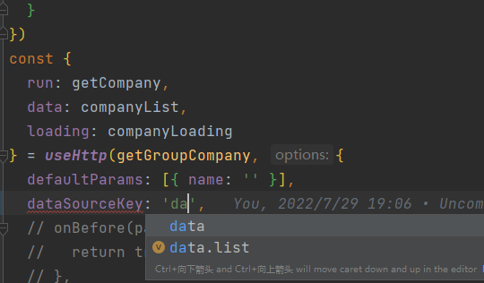

### 提取`Promise`的返回类型

```typescript
export type PromiseReturnType<T extends (...args: any) => any> =
    ReturnType<T> extends Promise<infer R> ? R : ReturnType<T>
```

```typescript
type PromiseData = ()=>Promise<{
  a: number
  b: string
}>

type Foo = PromiseReturnType<PromiseData>

// Foo = { a: number, b:string }

```

### 提取任意泛型的类型

```typescript

// 响应结构
interface GlobalResponse<T> {
  code: StatusCode
  msg: string
  data: T
}

// 拿到 GlobalResponse 中的T的类型
type ApiResponseReturnType<T> = T extends GlobalResponse<infer U> ? U : never

// example
type Foo = GlobalResponse<{
  foo: string
  bar: string
}>

type Bar = ApiResponseReturnType<Foo>
// Bar = {foo: string, bar: string}

```

### 提取对象路径
自己对[vue-request](https://github.com/AttoJS/vue-request) 这个库做了一层封装，为了实现动态获取接口返回数据，需要根据返回类型生成字段路径，传入方法拿到数据。

```typescript
type NestedKeyOf<ObjectType extends object> = {
  [Key in keyof ObjectType &
    (string | number)]: ObjectType[Key] extends unknown[]
    ? `${Key}`
    : ObjectType[Key] extends object
    ? `${Key}` | `${Key}.${NestedKeyOf<ObjectType[Key]>}`
    : `${Key}`
}[keyof ObjectType & (string | number)]
```
使用上述类型后，就可以根据返回类型拿到字段路径了

```typescript

// 全局响应结构
interface GlobalResponse<T> {
  code: StatusCode
  msg: string
  data: T
}

// 使用GlobalResponse重新组成返回类型
export type UseHttpDataSource<T extends AnyFun> = GlobalResponse<
    ApiResponseReturnType<PromiseReturnType<T>>
    >

// 拿到 GlobalResponse 中的T的类型
export type ApiResponseReturnType<T> = T extends GlobalResponse<infer U> ? U : never

// 提取函数返回数据的对象路径联合类型
export type UseHttpDataSourceKeys<T extends AnyFun> = NestedKeyOf<
    UseHttpDataSource<T>
    >
// 对axios的封装，这里不展示
const getData = (params: { name: string }) =>
  request.get<{
    data: {
      list: string[]
    }
  }>('/api/example', params)


// useHttp内部对dataSourceKey定义为UseHttpDataSourceKeys
const {
  run,
  data, // 经过dataSourceKey的处理，返回结果为string[]
  loading
} = useHttp(getData, {
  defaultParams: [{ name: '' }],
  dataSourceKey: 'data.list', // 传入路径，在自己封装的useHttp中根据路径拿到数据
  debounceInterval: 300
})
```
由于做了类型定义，这里很容易得到编辑器提示


### useHttp
放一份自己对[vue-request](https://github.com/AttoJS/vue-request)封装的hook，仅作为参考，许多类型定义没有放出来

```typescript
import { Ref, ref } from 'vue'
import {
  PromiseReturnType,
  YxResponse,
  YxResponseReturnType
} from '@/types/app'
import { useRequest, Options } from 'vue-request'
import { otherUtil } from '@/utils'
export type UseHttpDataSourceKeys<T extends AnyFun> = NestedKeyOf<
  UseHttpDataSource<T>
>
export type UseHttpDataSource<T extends AnyFun> = YxResponse<
  YxResponseReturnType<PromiseReturnType<T>>
>
export type UseHttpDataType<T extends AnyFun, K extends string> = TypeFromPath<
  UseHttpDataSource<T>,
  K
>
export type UseHttpServiceParams<T extends AnyFun> = Parameters<T>
type RequestOptions<
  T extends AnyFun,
  K extends string,
  D extends unknown[]
> = Omit<
  Options<UseHttpDataType<T, K>, D>,
  | 'onSuccess'
  | 'onBefore'
  | 'manual'
  | 'onError'
  | 'onAfter'
  | 'initialData'
  | 'ready'
>
export type UseHttpOptions<
  T extends AnyFun,
  K extends string,
  D extends UseHttpServiceParams<T>,
  C extends any[]
> = RequestOptions<T, K, D> & {
  manual?: boolean
  dataSourceKey?: K & UseHttpDataSourceKeys<T>
  onBefore?: (
    ...params: ArrayConcat<D, C>
  ) =>
    | [...UseHttpServiceParams<T>]
    | boolean
    | undefined
    | void
    | Promise<[...UseHttpServiceParams<T>] | boolean>
  onSuccess?: (
    data: Ref<UseHttpDataType<T, K>>,
    params: ArrayConcat<D, C>
  ) => void
  onError?: (error: YxResponse<any>, ...params: ArrayConcat<D, C>) => void
  onAfter?: (...params: ArrayConcat<D, C>) => void
  onControl?: (params: D, ...controls: C) => [...UseHttpServiceParams<T>]
  initialData?: Partial<UseHttpDataType<T, K>>
}

type RequestReturnType = ReturnType<typeof useRequest>

export type UseHttpReturn<
  T extends AnyFun,
  K extends string,
  D extends unknown[],
  C extends any[]
> = {
  runAsync: (...params: D) => Promise<UseHttpDataSource<T>>
  run: (...params: D) => void
  loading: RequestReturnType['loading']
  error: RequestReturnType['error']
  data: Ref<UseHttpDataType<T, K>>
  params: Ref<never[] | D>
  refresh: () => void
  refreshAsync: () => Promise<UseHttpDataSource<T>>
  runWithControl: (...controls: C) => void
  runWithControlAsync: () => Promise<UseHttpDataSource<T>>
}
function useHttp<
  T extends AnyFun,
  K extends UseHttpDataSourceKeys<T>,
  D extends UseHttpServiceParams<T>,
  C extends any[]
>(fun: T, options?: UseHttpOptions<T, K, D, C>): UseHttpReturn<T, K, D, C> {
  const data = ref(options?.initialData || {}) as unknown as Ref<
    UseHttpDataType<T, K>
  >
  options = {
    ...options
  }

  const requestOptions: Record<string, any> = {
    refreshDepsAction: () => {
      run(...params.value)
    }
  }
  const keys = [
    'onSuccess',
    'onBefore',
    'manual',
    'onError',
    'onAfter',
    'initialData',
    'ready'
  ]
  const optionKeys = Object.keys(options || {}) as Array<
    keyof RequestOptions<T, K, D>
  >
  optionKeys.forEach((item) => {
    if (!keys.includes(item)) {
      if (options) {
        requestOptions[item] = options[item]
      }
    }
  })
  const currentCreateQuery = ref([]) as unknown as Ref<C>
  const {
    runAsync: rAsync,
    loading,
    params,
    error
  } = useRequest(fun, {
    ...requestOptions,
    defaultParams: options?.defaultParams,
    manual: true,
    onSuccess(res) {
      let result = (res || {}) as UseHttpDataSource<T> & Record<string, any>
      if (options?.dataSourceKey) {
        const dataSourceKey = (options?.dataSourceKey || '').split('.') || []
        dataSourceKey.forEach((item) => {
          result = result[item]
        })
      }
      data.value = result as UseHttpDataType<T, K>
      if (options?.onSuccess) {
        options.onSuccess(data, [...params.value, ...currentCreateQuery.value])
      }
    },
    onError(error) {
      const err = error as unknown as YxResponse<any>
      if (options?.onError) {
        options.onError(err, ...params.value, ...currentCreateQuery.value)
      }
    },
    onAfter() {
      if (options?.onAfter) {
        options.onAfter(...params.value, ...currentCreateQuery.value)
      }
    }
  })
  const beforeCallBack = ():
    | [...UseHttpServiceParams<T>]
    | boolean
    | undefined
    | Promise<[...UseHttpServiceParams<T>] | boolean>
    | void => {
    if (options?.onBefore) {
      return options.onBefore(...params.value, ...currentCreateQuery.value)
    } else {
      return true
    }
  }
  const runAsync = (...query: D): any => {
    if (loading.value) {
      return
    }
    const onBeforeResult = beforeCallBack()
    const resType = otherUtil.getPrototypeType(onBeforeResult)
    if (resType === 'Promise') {
      ;(onBeforeResult as Promise<[...UseHttpServiceParams<T>] | boolean>).then(
        (res) => {
          const type = typeof res
          if (type === 'boolean' && !onBeforeResult) {
            return
          }
          if (Array.isArray(res)) {
            query = res
          }
          return rAsync(...(query || params.value))
        }
      )
      return
    }
    if (resType === 'Boolean' && !onBeforeResult) {
      return
    }
    if (resType === 'Array') {
      query = onBeforeResult as D
    }
    return rAsync(...(query || params.value))
  }
  const run = (...query: D): void => {
    runAsync(...query)
  }
  if (!options?.manual) {
    run(...params.value)
  }
  const refresh = () => {
    run(...params.value)
  }
  const refreshAsync = () => {
    return runAsync(...params.value)
  }

  const runWithControl = (...controls: C) => {
    currentCreateQuery.value = controls
    let query = params.value
    if (options?.onControl) {
      query = options.onControl(params.value, ...controls)
      params.value = query
    }
    run(...query)
  }

  const runWithControlAsync = (...controls: C) => {
    let query = params.value
    currentCreateQuery.value = controls
    if (options?.onControl) {
      query = options.onControl(params.value, ...controls)
      params.value = query
    }
    return runAsync(...query)
  }

  return {
    run,
    loading,
    runAsync,
    data,
    params,
    error,
    refresh,
    refreshAsync,
    runWithControl,
    runWithControlAsync
  }
}

export default useHttp
```

### 未完待续
